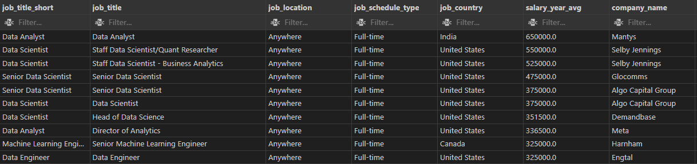
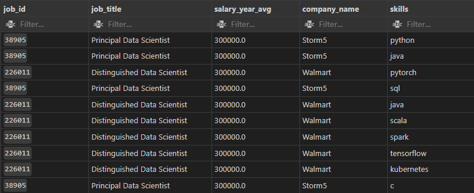
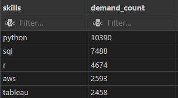
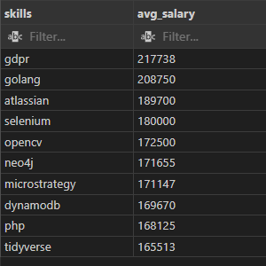
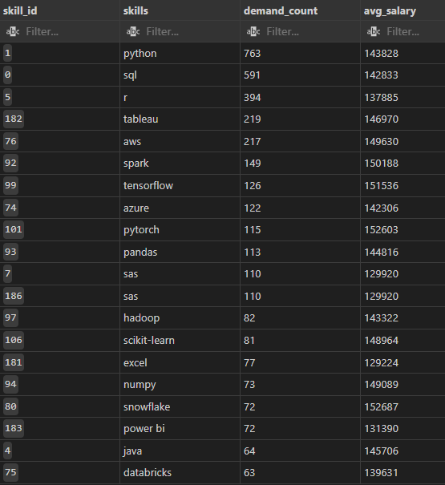

# SQL_Project_Job_Data_Analysis
# Introduction
📊 Dive into the data job market! Focusing on data science roles, this project explores 💰 top-paying jobs, 🔥 in-demand skills, and 📈 where high demand meets high salary in data scientist.

🔍 SQL queries? Check them out here: [SQL_project](/SQL_project_01/)

### The questions I wanted to answer through my SQL queries were:

1. What are the top-paying data scientist jobs?
2. What skills are required for these top-paying jobs?
3. What skills are most in demand for data scientists?
4. Which skills are associated with higher salaries?
5. What are the most optimal skills to learn?

# Tools I Used
For my deep dive into the data scientist job market, I harnessed the power of several key tools:

- **SQL:** The backbone of my analysis, allowing me to query the database and unearth critical insights.
- **PostgreSQL:** The chosen database management system is ideal for handling the job posting data.
- **Visual Studio Code:** My go-to for database management and executing SQL queries.
- **Git & GitHub:** Essential for version control and sharing my SQL scripts and analysis, ensuring collaboration and project tracking.

# The Analysis
Each query for this project aimed to investigate specific aspects of the data science job market. Here’s how I approached each question:

### 1. Top Paying Data Jobs
To identify the highest-paying roles, I filtered data  positions by average yearly salary and location. This query highlights the high-paying opportunities in the field.

```sql

SELECT 
  job_title_short,
  job_title,
  job_location,
  job_schedule_type,
  job_country,
  salary_year_avg,
  name as company_name
FROM
  job_postings_fact
LEFT JOIN company_dim
  ON job_postings_fact.company_id = company_dim.company_id
WHERE 
  job_location= 'Anywhere' AND
  salary_year_avg IS NOT NULL
ORDER BY
  salary_year_avg DESC
LIMIT 10

```
Here's the breakdown of the top data analyst jobs in 2023:
- **Wide Salary Range:** Top 10 paying data roles span from $325000 to $650,000, indicating significant salary potential in the field.
- **Diverse Employers:** Companies like Mantys, Meta, and Shelby Jennings offer high salaries, showing a broad interest across different industries.
- **Job Title Variety:** There's a high diversity in job titles, from Data Analyst to Data Scientist, reflecting varied roles and specializations within data scientist.




### 2. Skills for Top Paying Jobs
To understand what skills are required for top-paying jobs, I joined the job postings with the skills data, providing insights into what employers value for high-compensation roles.
```sql

WITH top_paying_jobs AS (
    SELECT
        job_id,
        job_title,
        salary_year_avg,
        name AS company_name
    FROM 
        job_postings_fact
    LEFT JOIN company_dim
        ON job_postings_fact.company_id = company_dim.company_id
    WHERE 
        job_title_short='Data Scientist' AND
        job_location= 'Anywhere' AND
        salary_year_avg IS NOT NULL
    ORDER BY
        salary_year_avg DESC
    LIMIT 10
)
    SELECT 
        top_paying_jobs.*,
        skills 
    FROM top_paying_jobs
    INNER JOIN skills_job_dim
        ON top_paying_jobs.job_id = skills_job_dim.job_id
    INNER JOIN skills_dim
        ON skills_job_dim.skill_id=skills_dim.skill_id
    ORDER BY 
    salary_year_avg
    LIMIT 10

```
Here's the breakdown of the most demanded skills for the top 10 highest-paying data scientist jobs in 2023:
- **Python** ,**Pandas**,**Numpy**,**Tensorflow**
- **AWS** is also highly sought.
- **Scale**, **Spark**, **Pandas** show varying degrees of demand.




### 3. In-Demand Skills for Data Scientist

This query helped identify the skills most frequently requested in job postings, directing focus to areas with high demand.

```sql
SELECT 
    skills ,
    COUNT (skills_job_dim.job_id) AS demand_count
FROM job_postings_fact
INNER JOIN skills_job_dim
    ON job_postings_fact.job_id = skills_job_dim.job_id
INNER JOIN skills_dim
    ON skills_job_dim.skill_id=skills_dim.skill_id
WHERE 
    job_title_short='Data Scientist' AND
    job_work_from_home = TRUE
group BY 
    skills
ORDER BY 
    demand_count DESC
LIMIT 5
```
Here's the breakdown of the most demanded skills for data Scientist in 2023
- **SQL**  remain fundamental, emphasizing the need for strong foundational skills in data processing and data manipulation.
- **Programming** , **Visualization Tools** and ** Model deployment** like **Python**, **Tableau**, and **AWS** are essential, pointing towards the increasing importance of technical skills in data storytelling and decision support.



*Table of the demand for the top 5 skills in data Scientist job postings*

### 4. Skills Based on Salary
Exploring the average salaries associated with different skills revealed which skills are the highest paying.
```sql
SELECT 
    skills,ROUND(AVG(salary_year_avg),0) AS avg_salary
FROM job_postings_fact
INNER JOIN skills_job_dim
    ON job_postings_fact.job_id=skills_job_dim.job_id
INNER JOIN skills_dim
    ON skills_job_dim.skill_id=skills_dim.skill_id
WHERE 
    job_title_short='Data Scientist' AND
    job_work_from_home = TRUE AND
    salary_year_avg IS NOT NULL
GROUP BY 
    skills
ORDER BY
    avg_salary DESC
limit 10
```
- Here's a breakdown of the results for top-paying skills for Data Scientists: 
 
  This analysis highlights the top-paying skills in the current job market, showcasing the value of specialized expertise:

- **Top-Paid Skills:** GDPR and Golang lead with average salaries of $217,738 and $208,750 respectively, reflecting the high demand for data protection and programming skills.
- **Automation and Computer Vision:** Skills in Selenium and OpenCV are highly valued, with average salaries of $180,000 and $172,500, emphasizing the importance of automation testing and computer vision.
- **Specialized Databases:** Expertise in Neo4j and DynamoDB commands significant salaries, averaging $171,655 and $169,670, indicating a demand for knowledge in specialized databases.
- **Business Intelligence:** Proficiency in MicroStrategy, a business intelligence tool, offers an average salary of $171,147, highlighting its role in data-driven decision-making.
- **Data Science Tools:** The Tidyverse package, crucial for data manipulation and visualization in R, offers an average salary of $165,513, underlining the importance of data science skills.
- **Programming Languages:** PHP continues to be a valuable skill, with an average salary of $168,125, demonstrating the ongoing need for programming expertise. 

These insights underscore the premium placed on specialized skills across various domains, from data protection and programming to automation, data science, and business intelligence.




*Table of the average salary for the top 10 paying skills for data Scientists*

### 5. Most Optimal Skills to Learn

Combining insights from demand and salary data, this query aimed to pinpoint skills that are both in high demand and have high salaries, offering a strategic focus for skill development.

```sql
SELECT 
    skills_dim.skill_id,
    skills_dim.skills,
    COUNT(skills_job_dim.job_id) AS demand_count,
    ROUND(AVG(job_postings_fact.salary_year_avg), 0) AS avg_salary
FROM job_postings_fact
INNER JOIN skills_job_dim ON job_postings_fact.job_id = skills_job_dim.job_id
INNER JOIN skills_dim ON skills_job_dim.skill_id = skills_dim.skill_id
WHERE
    job_title_short = 'Data Scientist'
    AND salary_year_avg IS NOT NULL
    AND job_work_from_home = True 
GROUP BY
    skills_dim.skill_id
HAVING
    COUNT(skills_job_dim.job_id) > 20
ORDER BY
    demand_count DESC,
    avg_salary DESC
LIMIT 20;

```


*Table of the most optimal skills for data scientists sorted by salary*

# Data Science Skills Demand and Salary Insights
- **Top Demand:** Python (763 postings, $143,828) and SQL (591 postings, $142,833) are the most sought-after skills.
- **Highest Salaries:**yTorch ($152,603), Snowflake ($152,687), and TensorFlow ($151,536) offer the highest average salaries.
- **Specialized Tools:** Tableau (219 postings, $146,970) and AWS (217 postings, $149,630) are critical for visualization and cloud computing.
- **Machine Learning & Big Data:** Spark (149 postings, $150,188) and Hadoop (82 postings, $143,322) are essential technologies.
- **Core Libraries:** Pandas (113 postings, $144,816) and Numpy (73 postings, $149,089) are vital for data manipulation.
- **Business Intelligence:** Power BI (72 postings, $131,390) and Excel (77 postings, $129,224) are key for data analysis.
- **Programming Languages:** Java (64 postings, $145,706) remains significant.
- **Emerging Platforms:** Databricks (63 postings, $139,631) is growing in relevance.

# What I Learned

Throughout this adventure, I've turbocharged my SQL toolkit with some serious firepower:

- **🧩 Complex Query Crafting:** Mastered the art of advanced SQL, merging tables like a pro and wielding WITH clauses for ninja-level temp table maneuvers.
- **📊 Data Aggregation:** Got cozy with GROUP BY and turned aggregate functions like COUNT() and AVG() into my data-summarizing sidekicks.
- **💡 Analytical Wizardry:** Leveled up my real-world puzzle-solving skills, turning questions into actionable, insightful SQL queries.

# Conclusions

### Insights
From the analysis, several general insights emerged:

1. **Top-Paying Data Scientist Jobs**: The highest-paying jobs for data Scientists that allow remote work offer a wide range of salaries, the highest at $650,000!
2. **Skills for Top-Paying Jobs**: High-paying data Scientist jobs require advanced proficiency in Python, python libraries, and AWS suggesting it’s a critical skill for earning a top salary.
3. **Most In-Demand Skills**: SQL is also the most demanded skill in the data analyst job market, thus making it essential for job seekers.
4. **Skills with Higher Salaries**: Specialized skills, such as gdpr and OpenCV, are associated with the highest average salaries, indicating a premium on niche expertise.
5. **Optimal Skills for Job Market Value**: Python, SQL, AWS, and Tableau leads in demand and offers for a high average salary, positioning it as one of the most optimal skills for data Scientists to learn to maximize their market value.

### Closing Thoughts

This project enhanced my SQL skills and provided valuable insights into the data Scientist job market. The findings from the analysis serve as a guide to prioritizing skill development and job search efforts. Aspiring data Scientists can better position themselves in a competitive job market by focusing on high-demand, high-salary skills. This exploration highlights the importance of continuous learning and adaptation to emerging trends in the field of data Scientist.
